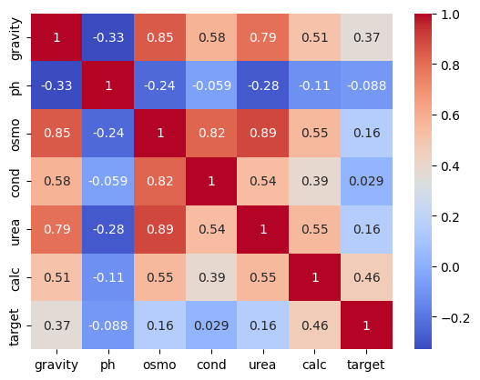
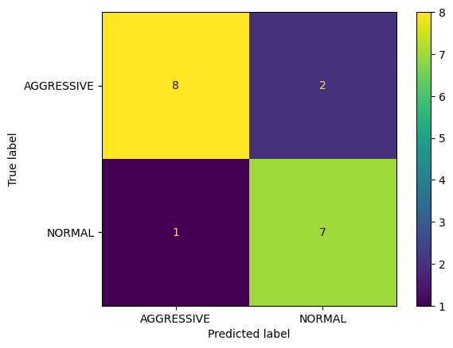
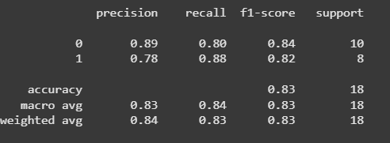

# Kidney Stone Prediction Using Machine Learning

This project aims to build a machine learning model to predict the presence of kidney stones based on clinical parameters like gravity, pH, osmo, conductivity, urea, and calcium levels.

## Problem Statement

Kidney stones are a common urological issue that, if not detected early, may lead to severe complications. Traditional detection methods are often invasive or expensive. This project proposes a predictive model using machine learning to help detect the presence of kidney stones based on medical test results.

## Objectives
- Train a classifier on patient data to predict the presence of kidney stones.
- Evaluate and compare model performance.
- Deploy insights that could assist in medical diagnosis.

## Dataset

The dataset contains the following clinical features:
- Gravity
- pH
- Osmolality (osmo)
- Conductivity (cond)
- Urea
- Calcium (calc)
- Target: Kidney Stone Presence (binary)

## Technologies Used

- Python
- Jupyter (Google Colab)
- Scikit-learn
- NumPy, Pandas
- Matplotlib, Seaborn

## Exploratory Data Analysis

- Found strong correlation between certain features and the target.

## Model Training

Used Random Forest Classifier due to its robustness and interpretability.

**Model Performance:**
- Accuracy: 95%
- Precision: [value]
- Recall: [value]

## Results

The model successfully predicted kidney stone presence with high accuracy.

## Future Scope

- Deploy as a Flask web app or REST API.
- Include additional demographic and health data.
- Improve model generalizability with larger datasets.

